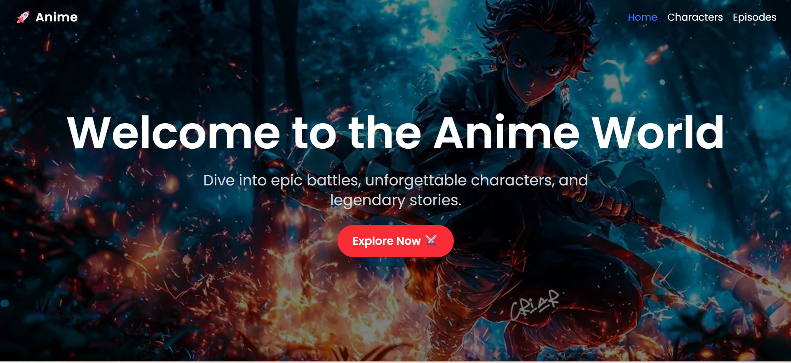
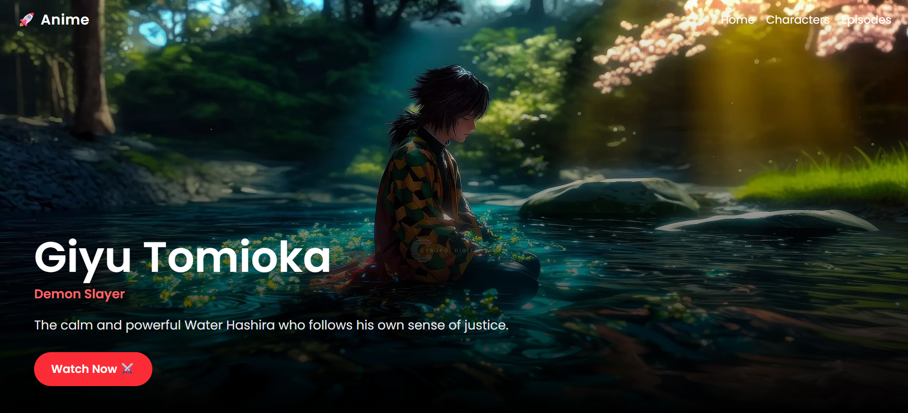
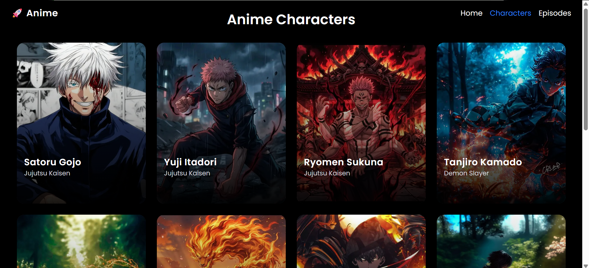

# 🚀 Anime World — Next.js Mini Project

> My first Next.js project! Built while learning the fundamentals of modern React-based web development.

---

## 📸 Preview
 
| Home Page | Character Detail | Characters |
|-----------|-----------------|-----------------|
|  |  |  |
 

---

## ✨ About The Project

**Anime World** is a mini anime showcase app where users can explore anime characters, view their details, and navigate through episodes. Built as a hands-on learning project to understand the core concepts of **Next.js 14** with the App Router.

No fancy APIs. No complex backend. Just clean fundamentals — the way every great developer starts. 💪

---

## 🛠️ Tech Stack

<div align="center">

| Technology | Version | Docs |
|------------|---------|------|
| [](https://nextjs.org/docs) | 14+ | [nextjs.org/docs](https://nextjs.org/docs) |
| [](https://react.dev) | 18+ | [react.dev](https://react.dev) |
| [](https://tailwindcss.com/docs) | 3+ | [tailwindcss.com/docs](https://tailwindcss.com/docs) |
| [](https://developer.mozilla.org/en-US/docs/Web/JavaScript) | ES2023 | [MDN Docs](https://developer.mozilla.org/en-US/docs/Web/JavaScript) |

</div>

---

## 📁 Project Structure

```
anime/
├── src/
│   ├── app/
│   │   ├── characters/
│   │   │   ├── [id]/
│   │   │   │   └── page.jsx        # Dynamic character detail page
│   │   │   └── page.jsx            # Characters grid page
│   │   ├── episodes/
│   │   │   └── page.jsx            # Episodes listing page
│   │   ├── layout.js               # Root layout with Navbar
│   │   ├── page.js                 # Home / Hero page
│   │   ├── globals.css
│   │   └── favicon.ico
│   ├── assets/
│   ├── components/
│   │   ├── CharacterCard.jsx       # Reusable card component
│   │   └── Navbar.jsx              # Navigation bar
│   └── utils/
│       └── animeData.js            # Static data (characters array)
└── public/                         # Images & static assets
```

---

## 🧠 Concepts I Practiced

### 🗂️ Next.js App Router
Learning the new `app/` directory structure — a big shift from the old `pages/` router. Each folder with a `page.jsx` becomes a route automatically.

### 🔗 File-based Routing
Creating routes just by creating folders — no need to configure anything manually. Clean and intuitive.
```
app/characters/page.jsx      →   /characters
app/episodes/page.jsx        →   /episodes
```

### ⚡ Dynamic Routes `[id]`
Using bracket notation `[id]` to create dynamic pages for each character. Each character gets its own URL like `/characters/gojo`.
```
app/characters/[id]/page.jsx  →  /characters/:id
```

### 🧩 Components & Reusability
Breaking the UI into small, reusable pieces like `<CharacterCard />` and `<Navbar />` — the React way of thinking.

### 🖼️ Next.js `<Image />` Component
Using the optimized `next/image` component instead of plain `` for better performance — lazy loading, auto-sizing, and priority loading.

### 🪝 `useParams` Hook
Reading dynamic route parameters (`id`) inside a client component using `useParams()` from `next/navigation`.

### 🖥️ Client vs Server Components
Understanding when to use `'use client'` — only components that need interactivity (hooks, event handlers) need it. Everything else is a Server Component by default.

### 🧭 `layout.js` — Shared Layout
Using `layout.js` to wrap all pages with a shared `<Navbar />` so it doesn't re-render on every route change.

### 🎨 Tailwind CSS Utility Classes
Styling everything with utility classes — no separate CSS files needed. `flex`, `grid`, `absolute`, `object-cover`, gradients, and responsive prefixes like `md:`.

### 📦 Static Data with Utility Files
Keeping character data in a `utils/animeData.js` file as a simple array and importing it wherever needed — a clean pattern for small projects.

---

## 🚀 Getting Started

```bash
# Clone the repository
git clone https://github.com/your-username/anime-world.git

# Navigate into the project
cd anime-world

# Install dependencies
npm install

# Run the development server
npm run dev
```

Open [http://localhost:3000](http://localhost:3000) in your browser. 🎉

---

## 📌 What I Learned as a Beginner

- ✅ How Next.js App Router differs from React Router
- ✅ Why Server Components exist and when to add `'use client'`
- ✅ How dynamic routes work with `[id]` folders
- ✅ How to use `next/image` for optimized images
- ✅ How to share layout across pages using `layout.js`
- ✅ How to organize a real project with components and utils
- ✅ Tailwind CSS for fast, responsive UI styling

---

## 🌱 What's Next

- [ ] Add a real Anime API (like Jikan API)
- [ ] Add search and filter functionality
- [ ] Add a favorites / watchlist feature
- [ ] Deploy on Vercel

---

## 👨‍💻 Author

Made with ❤️ while learning Next.js for the first time.

> *"Every expert was once a beginner."* — Keep building, keep growing! 🚀

---

<div align="center">
  <sub>⭐ Star this repo if it helped you understand Next.js basics too!</sub>
</div>